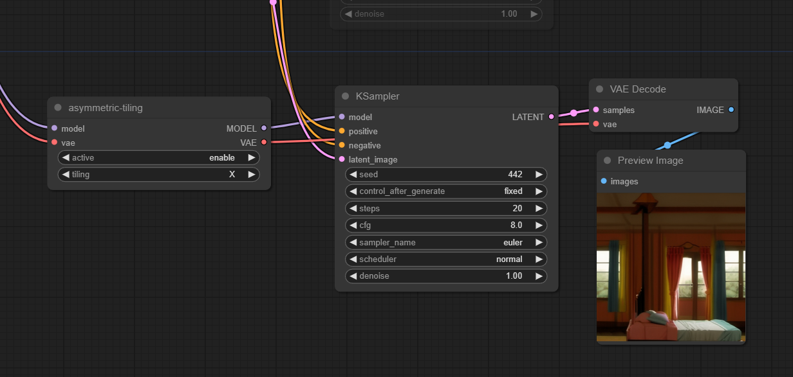

# asymtillingcomfyui
asymmetric tilling for comfyui, tilling, seamless

## Installation

`cd into ComfyUI/custom_nodes`
`git clone https://github.com/flankechen/asymtillingcomfyui.git`

start comfyui as usuall.

## AsymTilling

input: model/VAE.  
output: modified version of model/VAE.  
active: enable/disable.  
tilling: X or Y direction tilling.  

## Workflow

/examples_360/ holds a example workflow to create 360 image.  
check, here as well, https://openart.ai/workflows/DamuVsetWwgvrYzD3foi  

for 360 lora, https://civitai.com/models/480767?modelVersionId=534681  

## Credit
from  https://github.com/tjm35/asymmetric-tiling-sd-webui/ 